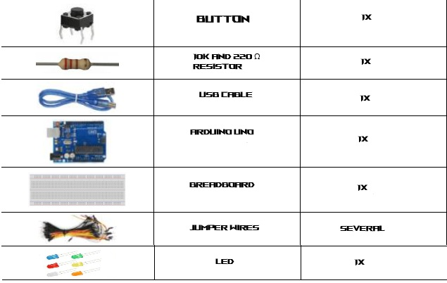
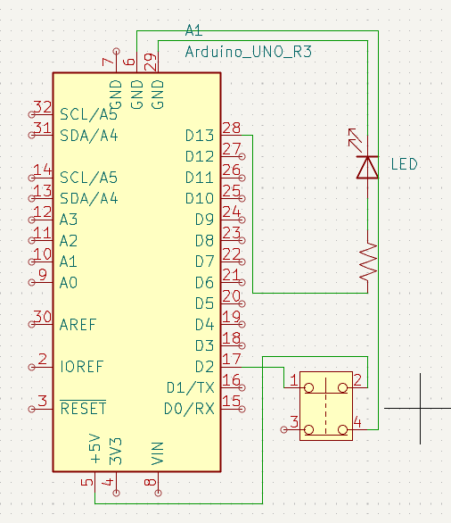
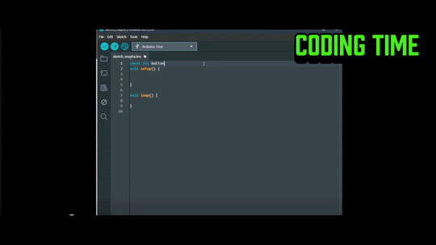

# Button-Controlled-LED
## Digital Input. Direct Output. Instant Response.

**Fifth step** in the embedded grind. This isn’t blinking on a timer — it’s about **control on demand**. **1 button. 1 LED. Immediate reaction.** Digital input triggering digital output, in real time.

---

## 🧭 Why This Matters

You’re bridging the physical world and code. A button press becomes logic. A signal becomes light. Every system—whether a washing machine or a rocket—starts with this cause-and-effect loop.

### ⚙️ What I Learned

- `digitalRead()` captures real-time button state  
- `digitalWrite()` sets hardware response  
- Pins need the right `pinMode()`  
- Input/output flow is the core of embedded logic  

---

## 🔩 Parts I Used



---

## 📈 Schematic



---

## 🛠️ Wiring


---

## 👨‍💻 The Code



```cpp
const int buttonPin = 2;
const int ledPin = 13;

int buttonState = 0;

void setup() {
  pinMode(ledPin, OUTPUT);
  pinMode(buttonPin, INPUT);
}

void loop() {
  buttonState = digitalRead(buttonPin);
  
  if (buttonState == HIGH) {
    digitalWrite(ledPin, HIGH);
  } else {
    digitalWrite(ledPin, LOW);
  }
}
```

## 🧠 The Concept
The button is the trigger. The LED is the response. No delay, no guesswork—just raw, digital cause-and-effect. It’s the bedrock of all interactive embedded systems.

---
## 🎬 Final Result


Push the button → LED turns on.
Release the button → LED turns off.
Simple. Immediate. Effective. 


# 🎥 Full Video:  https://youtu.be/u18720nr-sQ
